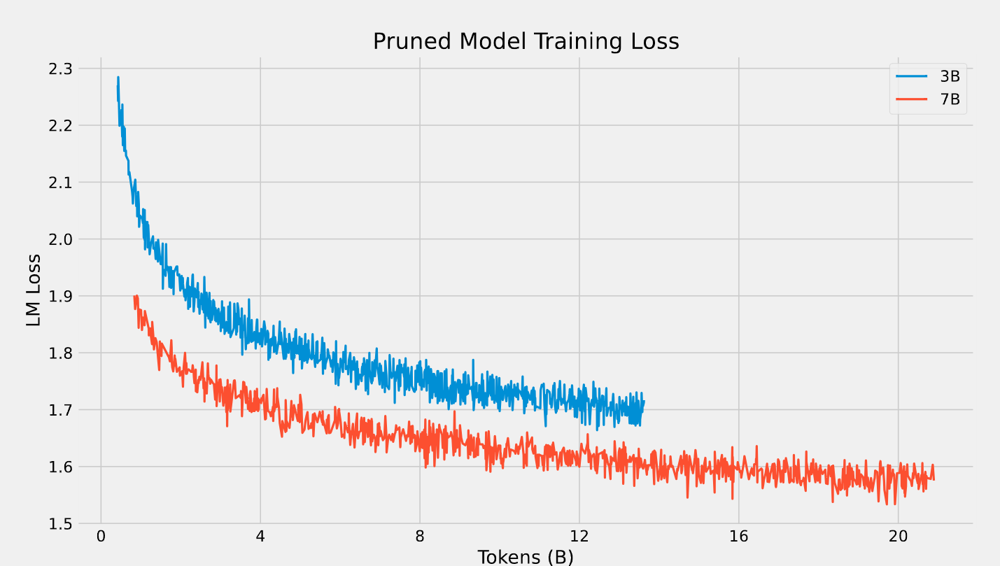
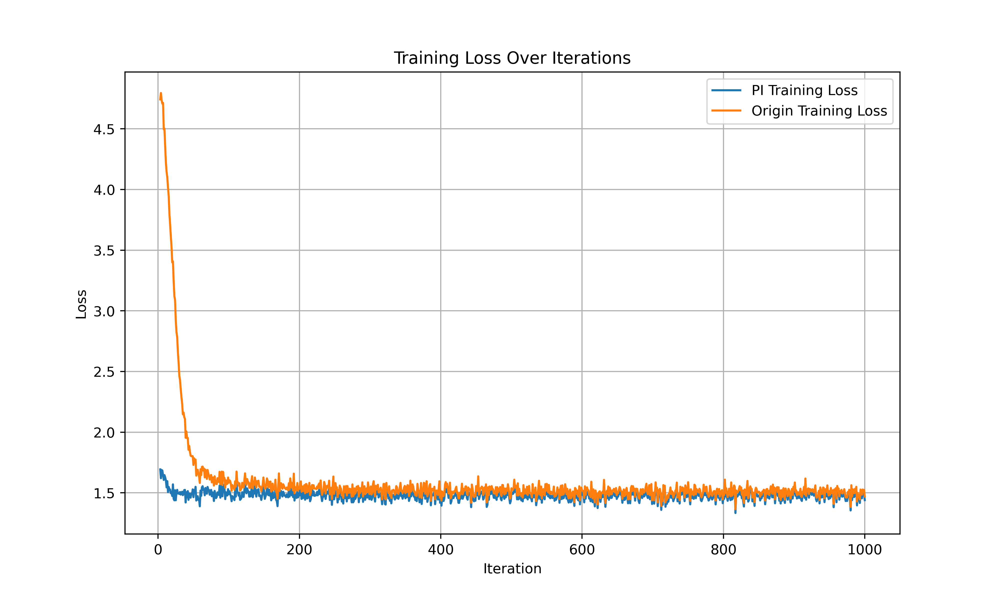

    

# Megatron Cookbook: Pre-training, Compressing, Extending, and Distilling Your LLMs

[[中文版](README_ZH.md)] [[English](README.md)]

大语言模型（LLMs）——具有大量的参数且在大量的文本数据中进行预训练的模型，在各种下游任务中表现出了非常强大的能力。然而，由于机器显存限制，训练这些模型将是一项具有挑战性的工作。为了应对这一挑战，我们构建了本代码库。该代码库是基于Megatron-LM项目构建的，并且实现了高效训练LLMs的技术。本代码库除了用于训练大模型的脚本外，本代码库还对一些其他的方法进行了探索，比如：压缩LLMs、扩展LLMs的上下文长度以及使用其他预训练大模型生成的合成文本进行蒸馏等等。

本代码库的亮点如下：

1）**预训练和微调**：为了获得训练LLM所需要的数据集，我们提供了相应的脚本来指导如何构建训练数据集。此外，本代码库可以将Llama权重的检查点在Huggingface格式和Megatron-LM格式之间来回转换。关于TFlops和token speed的测试指标是在8xA100-80GB机器上进行记录测试的。
2）**压缩**：利用结构化剪枝以及少量token的恢复训练， 支持将一个Transformer预训练模型裁剪成一个任意大小的新预训练模型，并保留大部分性能。
3）**上下文长度扩展**：使用Position Interpolation (PI)这个技术将llama2-7b模型的上下文长度从4096 tokens扩展到了8192 tokens。另外，我们提供了在Pile和PG19数据集上关于Perplexity（PPL）的测试结果。最后，本代码库还提供了一个脚本，该脚本可以将我们自己的13b LLM的上下文长度从4096 tokens扩展到32768 tokens。
4）**蒸馏**：利用Qwen-72B和Deepseek-67B模型来生成合成数据，然后使用生成的合成数据来对我们的13b模型进行持续训练。本代码库提供了相应的脚本来指导如何生成合成数据。同时，我们还记录了持续训练的结果性能指标。

# 内容

- [安装指南](#安装指南)
- [训练](#训练)
  - [数据预处理](#数据预处理)
  - [检查点转换](#检查点转换)
  - [训练样例-31B/65B/108B/132B](#训练样例-31B/65B/108B/132B)
- [模型压缩](#模型压缩)
- [上下文长度扩展](#上下文长度扩展)
  - [上下文长度扩展的例子](#上下文长度扩展的例子)
- [蒸馏](#蒸馏)
  - [生成合成数据](#生成合成数据)
  - [蒸馏的结果](#蒸馏的结果)

## 安装指南

类似于Megatron-LM，推荐使用带有DXG节点的[NGC&#39;s PyTorch container](https://ngc.nvidia.com/catalog/containers/nvidia:pytorch)的版本。为了可以成功运行PyTorch，可以按照以下步骤操作：

1、安装docker和nvidia-docker；
2、执行下列的Docker命令：

```bash
  docker pull nvcr.io/nvidia/pytorch:23.12-py3
  docker run --gpus all --shm-size=128g --net=host -dit --rm --name megatron -v /your_dir:/your_dir -v /root/.ssh:/root/.ssh nvcr.io/nvidia/pytorch:23.12-py3
```

3、安装sentencepiece and nltk

## 训练

可以根据下列几个步骤来训练自己的模型：

1、数据预处理：将文本数据转为适合训练的二进制格式
2、检查点转换：如果想要微调预训练的LLM，例如Llama2-7b，需要将它的权重从Huggingface格式转换为Megatron格式。但是，如果想要利用训练好的模型进行推理的话，为了简化推理过程，需要将权重从Megatron格式转换回Huggingface格式。
3、预训练：以一种有效的方式预训练自己的模型。

### 数据预处理

数据预处理步骤与[Megatron-LM](https://github.com/NVIDIA/Megatron-LM?tab=readme-ov-file#data-preprocessing)中提到的数据预处理的步骤一致。训练数据应该首先转化为loose JSON的格式，其中每一行包含一个单独的JSON对象，该对象表示一个文本样例。以下是为Llama训练准备数据的示例脚本：

```bash
python tools/preprocess_data.py \
    --input /Path/to/my-corpus.jsonl \
    --output-prefix /Path/to/my-corpus \
    --tokenizer-type Llama2Tokenizer \
    --tokenizer-model /Path/to/tokenizer.model \
    --append-eod \
    --workers 16
```

为了将多个二进制格式的数据集合并为一个数据集，请执行以下命令：

```bash
python tools/merge_datasets.py \
    --input /Path/to/datasets/folder \
    --output-prefix /Path/to/merged/dataset 
```

### 检查点转换

Megatron-LM采用pipeline并行和tensor并行来实现在有限内存下进行LLM的（大语言模型）训练。有时需要在检查点中更改pipeline并行和tensor并行的数量。下面是一个例子：

```bash
python tools/checkpoint/util.py \
    --model-type GPT \
    --load-dir /Path/to/ckpts/Llama2-7b-tp1 \
    --save-dir /Path/to/ckpts/Llama2-7b-tp4 \
    --target-tensor-parallel-size 4 \
    --target-pipeline-parallel-size 1 \
    --megatron-path /Path/to/Megatron
```

为了将Hugging Face格式的权重转换为Megatron格式，下面以Llama为例进行说明：

```bash
TP=1
HF_FORMAT_DIR=/Path/to/Llama-2-7b-hf
MEGATRON_FORMAT_DIR=/Path/to/Llama2-7b-tp1
TOKENIZER_MODEL=/Path/to/Llama-2-7b-hf/tokenizer.model

python tools/checkpoint/util.py \
    --model-type GPT \
    --loader llama2_hf \
    --saver megatron \
    --target-tensor-parallel-size ${TP} \
    --load-dir ${HF_FORMAT_DIR} \
    --save-dir ${MEGATRON_FORMAT_DIR} \
    --tokenizer-model ${TOKENIZER_MODEL}
```

为了将Hugging Face格式的权重转换为Megatron格式，首先应该使用上述脚本将Megatron检查点在pipeline并行和tensor并行中进行转换。以下是在Llama上的一个示例：

```bash
python tools/checkpoint_conversion/llama_checkpoint_conversion.py \
    --convert_checkpoint_from_megatron_to_transformers \
    --load_path "/Path/to/Llama2-7b-tp1" \
    --save_path "/Path/to/Llama2-7b-hf" \
    --target_params_dtype "bf16" \
    --make_vocab_size_divisible_by 1 \
    --print-checkpoint-structure \
    --megatron-path /Path/to/Megatron
```

### 训练样例-31B/65B/108B/132B

本代码库提供了训练基于llama的LLMs的脚本，包括[31B](./scripts/llama_30B.sh)、[65B](./scripts/llama_70B.sh)、[108B](./scripts/llama_108B.sh)和[132B](./scripts/llama_130B.sh)。下表记录了在A100-SXM4-80G上的TFlops和token speed：

|                                            | 31B   | 65B   | 108B  | 132B  |
| -----------------------------------------: | ----- | ----- | ----- | ----- |
|                  **TFLOP/s per GPU** | 161   | 161   | 174   | 177   |
| **Tokens / day 8$\times$A100-80g** | 0.59B | 0.27B | 0.17B | 0.15B |

## 模型压缩

利用结构化剪枝以及少量token的恢复训练， 支持将一个Transformer预训练模型裁剪成一个任意大小的新预训练模型，并保留大部分性能。对于一个transformer模型，参数量大小由 ``layer_num, hidden_size, intermediate_size, num_attention_heads``决定。使用此份代码，只需要设置新的 ``drop_layers,hidden_size_remain,intermediate_size_remain```,```num_attetion_heads_remain``即可将模型裁剪为更小的模型。
我们利用该代码库分别实现将llama2-13B压缩至7B以及llama2-7B压缩至3.4B，并分别进行20B以及12B数据的恢复训练，压缩过程效果如下：

#### 参数设置：

| Model       | layer_num | hidden_size | intermediate_size | num_attention_heads |      ml loss      |
| :---------- | :-------: | :---------: | :---------------: | :-----------------: | :---------------: |
| LLaMA2-13B  |    40    |    5120    |       13824       |         40         |       1.50       |
| LLaMA2-7B   |    32    |    4096    |       11006       |         32         |       1.54       |
| Pruned-7B   |    32    |    4096    |       11006       |         32         | 1.56 (20B tokens) |
| Pruned-3.4B |    28    |    3072    |       8192       |         28         | 1.71 (12B tokens) |

#### 恢复曲线



详细的使用方法以及裁剪后效果比较可以参考 [模型压缩](./pruner/README_EN.md)。

## 上下文长度扩展

LLMs的上下文长度通常是固定的，比如LLaMA的上下文长度为2048，LLaMA2的上下文长度为4096。然而，这些固定的上下文长度可能不足以满足那些需要更长上下文窗口的下游任务，比如长上下文对话任务或者是长文档中的信息抽取任务。因此，我们需要扩展预训练LLMs的上下文窗口。本代码库使用[Position Interpolation](https://arxiv.org/pdf/2306.15595.pdf)将上下文窗口从4096扩展到32768，并且提供了相应的脚本。值得一提的是，只需要通过1000步的持续训练，Position Interpolation就能在长文本建模中达到高质量的性能。

### 上下文长度扩展的例子

本代码库进行了两种不同的实验设置来扩展基于llama模型的上下文长度。可以在[这里](./scripts/llama7B_stretch_8k.sh)找到将7B模型的token长度从4096扩展到8192的脚本，以及在[这里](./scripts/llama13B_strech_32k.sh)找到将13B模型的token长度从4096扩展到32768的脚本。下图用于说明在8192上下文长度下，带有Position Interpolation和不带有Position Interpolation的7B模型的损失比较。持续训练是在[Pile](https://arxiv.org/pdf/2101.00027.pdf)数据集上进行的。



我们进行了一系列测试，以比较在Pile和PG-19数据集上，原始的Llama2-7b及其变体（包括带有Position Interpolation（PI）和不带PI的版本）在困惑度（Perplexity，PPL）上的性能。以下是测试结果：

**Pile evaluation dataset：**

|                    | 4096  | 8192  |
| ------------------ | ----- | ----- |
| Original Llama2-7b | 6.137 | -     |
| W/ PI + fine-tune  | 5.978 | 5.859 |
| w/o PI + fine-tune | 6.066 | -     |

**PG-19：**

|                    | 4096  | 8192  |
| ------------------ | ----- | ----- |
| Original Llama2-7b | 5.956 | -     |
| W/ PI + fine-tune  | 5.861 | 5.702 |
| w/o PI + fine-tune | 5.943 | -     |

结果表明，通过position interpolation，仅需1000步就可以实现高质量的长上下文语言建模。

当将Megatron格式的检查点转为Huggingface格式的检查点的时候，记住需要将调整rotary embedding中的freqs。比如，当rotary-seq-len-interpolation-factor为2时，我们需要修改modeling_llama.py中相关的函数：

```python
def _set_cos_sin_cache(self, seq_len, device, dtype):
    self.max_seq_len_cached = seq_len
# t = torch.arange(self.max_seq_len_cached, device=device, dtype=self.inv_freq.dtype)
    t = torch.arange(self.max_seq_len_cached, device=device, dtype=self.inv_freq.dtype) / 2.0 
    # Change t with rotary-seq-len-interpolation-factor 

    freqs = torch.einsum("i,j->ij", t, self.inv_freq)
    # Different from paper, but it uses a different permutation in order to obtain the same calculation
    emb = torch.cat((freqs, freqs), dim=-1)
    self.register_buffer("cos_cached", emb.cos()[None, None, :, :].to(dtype), persistent=False)
    self.register_buffer("sin_cached", emb.sin()[None, None, :, :].to(dtype), persistent=False)
```

## 蒸馏

蒸馏是将大语言模型在预训练过程中所获取的知识和能力迁移到更小且更具有风格的模型中的有效方法。在本代码库中，我们首先利用其他的大语言模型来合成数据，例如[Deepseek-67B](https://huggingface.co/deepseek-ai/deepseek-llm-67b-base)和[Qwen-72B](https://github.com/QwenLM/Qwen)，然后使用合成的数据来训练我们自己的13B模型。这一策略在[FinEval](https://github.com/SUFE-AIFLM-Lab/FinEval/tree/main)金融测试数据集上取得了性能改善。

### 生成合成数据

为了可以快速又高效的生成合成数据，我们使用[vllm](https://github.com/vllm-project/vllm)进行推理。我们将预训练数据的前缀当作生成合成数据的提示。该过程使用的脚本[这里](./inference_distill/scripts)找到。

### 蒸馏的结果

我们在[FinEval](https://github.com/SUFE-AIFLM-Lab/FinEval/tree/main)数据集上评估蒸馏之后的模型, 结果如下：

| model                 | Accounting | Certificate | Economy | Finance | Average |
| --------------------- | ---------- | ----------- | ------- | ------- | ------- |
| base-model            | 43.60      | 44.61       | 40.09   | 49.83   | 44.91   |
| distill on 3B tokens  | 40.00      | 49.70       | 42.02   | 47.54   | 45.17   |
| distill on 10B tokens | 43.27      | 47.90       | 38.64   | 51.14   | 45.87   |
